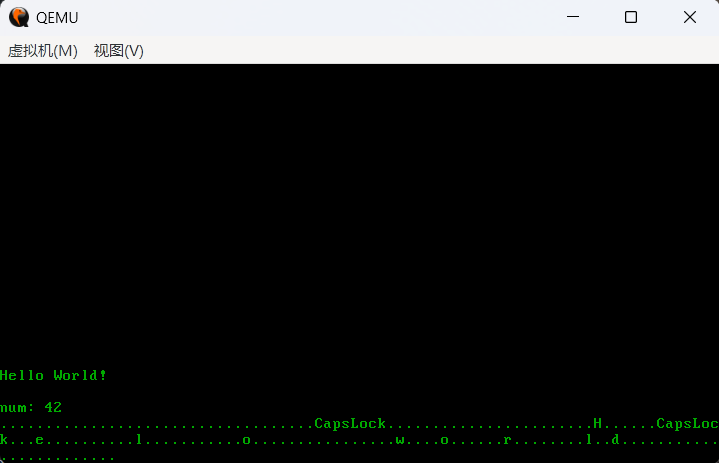

# 🦀 Rust-OS


这是一个基于 x86_64 架构、运行在裸机 (Bare Metal) 上的微型操作系统内核。
本项目紧随 [Writing an OS in Rust (blog_os)](https://os.phil-opp.com/) 教程，使用纯 Rust (`#![no_std]`) 编写，旨在深入理解操作系统底层原理、内存管理以及 Rust 的所有权模型在系统级编程中的应用。

> **演示截图** >
> 

## ✨ 已实现特性 (Features)

-   **VGA 字符驱动**：支持宏打印 (`println!`) 及全局自旋锁 (Spinlock) 保护。
-   **异常处理 (IDT)**：实现了双重错误 (Double Fault) 处理，防止内核栈溢出。
-   **硬件中断 (PIC)**：支持 Intel 8259 PIC，实现了定时器中断及键盘输入中断。
-   **内存管理 (Paging)**：
    -   实现了递归页表映射。
    -   基于 `x86_64` crate 的物理内存帧分配器。
-   **堆分配器 (Heap Allocation)**：
    -   实现了能够动态扩展的内核堆。
    -   支持 `Box`, `Vec`, `Rc` 等 `alloc` 库常用类型。
-   **异步多任务 (Async/Await)**：
    -   手写 `Executor` 和 `Waker`，支持协作式多任务处理。
    -   实现了基于扫描码的异步键盘任务。

## 🛠️ 构建与运行

本项目依赖 Rust Nightly 工具链及 QEMU 模拟器。

### 1. 环境准备

**QEMU**
请确保已安装 `qemu-system-x86_64`。

-   **macOS**: `brew install qemu`
-   **Ubuntu**: `sudo apt install qemu-system-x86`
-   **Windows**: [官网下载](https://www.qemu.org/download/)

**Bootimage**
用于构建可引导的磁盘镜像。

```bash
cargo install bootimage
```

Rust 组件 本项目通过根目录下的 rust-toolchain.toml 文件自动锁定和使用指定的 Nightly 版本。请确保已安装必要的组件：

```Bash
# 安装构建 OS 核心库和工具所需的组件

rustup component add llvm-tools-preview
rustup component add rust-src
```

### 2. 启动内核 (Run Kernel)

确保所有依赖已安装后，直接运行以下命令即可编译并启动 QEMU：

```Bash
cargo run
```

### 3. 测试 (Testing)

本项目包含集成测试。运行测试前，需要安装 runner 组件：

```Bash

# 安装 runner 组件（用于在 QEMU 中执行测试）

cargo install cargo-xbuild

# 注意：在 blog_os 的某些版本中可能需要安装 runner
```

运行测试：

```Bash
cargo test
```

## 📚 参考资料 (References)

-   [Writing an OS in Rust](https://os.phil-opp.com/) - Philipp Oppermann
-   [Rust OSDev Wiki](https://osdev.wiki/)

---

<div align="left">
    <small>Created by Tassel</small>
</div>
